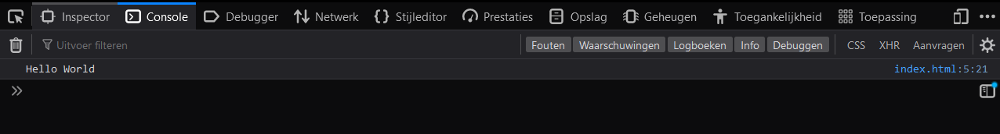

# Lesson 1 - Console and Comments (L1)

# Task L1.1 - Hello World

In this task you will write a javascript script that prints "Hello World" to the console.
To set up the environment, you will need to create a folder called hello-world and add the code below in a file called index.html.
The name of the folder and the file can be anything you want, but for the sake of this tutorial, we will use the names mentioned above.

```html
<!DOCTYPE html>
<html lang="en">
    <head>
        <script src="index.js"></script>
    </head>
    <body></body>
</html>
```

In this course we will not be going into detail about HTML, but for now, you can think of it as a container for your javascript code.
The script tag in the head section of the HTML file will load the javascript code from the index.js file.

Next you will need to create the index.js file and log the message "Hello World" to the console.
To run the code, open the index.html file in your browser.
To view the console, press F12 and select the console tab in the developer tools window.

This is what your console should look like (Your dev tools window may look different):


# Task L1.2 - Console functions

In this task you will learn how to use the console.log, console.info, console.warn, and console.error functions.
To set up the environment, you will need to create a folder called console-functions and create a file called index.js.
You can use the same index.html file from the previous task.

Next log 4 different messages to the console using the console.log, console.info, console.warn, and console.error functions.
Add meaningful comments to your code to explain what each function does.

This is what your console should look like (Your text may be different):


Notice the difference between the log, info, warn, and error messages.

If you are interested in learning more about console functions, you can read the documentation here:
[https://developer.mozilla.org/en-US/docs/Web/API/Console](https://developer.mozilla.org/en-US/docs/Web/API/Console)
