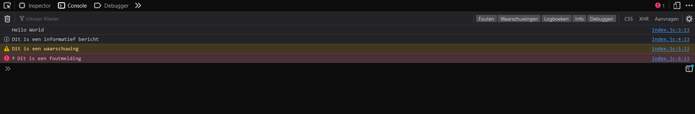

---

[Download begin code](../sources/l1-start.zip)
<br>
[Download eind code](../sources/l1-end.zip)

---

# Console en data types

Welkom bij de eerste les van de cursus JavaScript basis.
In deze eerste les ga ik het hebben over het gebruiken van de console, het maken van commentaar in je code
en de verschillende data types die je kan gebruiken in JavaScript.

## Console

De console in JavaScript kan je gebruiken om berichten te tonen die alleen voor jou als programmeur bedoeld zijn.
Om deze berichten te kunnen zien moet je de console openen in je browser.

Voordat we dat doen gaan we eerst een bericht in de console zetten.

Open het bestand `index.js` in de map `js`. Hier gaan we de hele cursus in werken.
In dit bestand staan al een paar regels code die we later gaan gebruiken.
Voor nu kan je alles plaatsen onder de regel `// Start coding here`.

Om een bericht in de console te zetten gebruiken we de functie `console.log()`.
Deze functie kan je gebruiken om een bericht te tonen in de console.

Zet de volgende regel code onder de regel `// Start coding here`:

```js
console.log("Hello World");
```

Om dit bericht te bekijken gaan we de console openen in de browser.
Dit kan je doen door op de toetsen `Ctrl + Shift + I` te drukken.
Daarna klik je op het tabblad `Console`.

Als je de console hebt geopend zie je het bericht `Hello World` staan.


Ik gebruik firefox als browser, maar als je een andere browser gebruikt ziet het er ongeveer hetzelfde uit.

Als volgende gaan we andere soorten berichten in de console zetten, zoals waarschuwingen en foutmeldingen.

Zet de volgende regels code onder de regel `console.log("Hello World");`:

```js
console.info("Dit is een informatief bericht");
console.warn("Dit is een waarschuwing");
console.error("Dit is een foutmelding");
```

Als je nu de console opent in de browser zie je de verschillende berichten staan.



Deze berichten kan je gebruiken om jezelf te helpen bij het programmeren.
Als je bijvoorbeeld een foutmelding krijgt in de console weet je dat er iets mis is gegaan in je code.

De berichten kunnen nu verwijderd worden, want we gaan deze niet gebruiken voor onze rekenmachine.

## Data types

Nu we weten hoe je een bericht in de console kan zetten gaan we kijken naar de verschillende data types die je kan gebruiken in JavaScript.
Dit gaan we doen door ze te laten zien in de console.

Zet de volgende berichten in de console:
- `"Hallo Wereld"`
- `42`
- `true`
- `null`
- `undefined`

Je code ziet er nu ongeveer zo uit:

```js
console.log("Hallo Wereld");
console.log(42);
console.log(true);
console.log(null);
console.log(undefined);
```

Laten we voordat we de console openen kijken naar null en undefined.
Deze twee data types lijken op elkaar, maar zijn niet hetzelfde.

`null` betekent dat er geen waarde is.  
`undefined` betekent dat er geen waarde is toegewezen.

Als je nu de console opent in de browser zie je de waardes van verschillende data types staan.
Om nu de data types te kunnen zien moeten we iets toevoegen aan de code.

Zet voor elke waarde de functie `typeof`:

```js
console.log(typeof "Hallo Wereld");
console.log(typeof 42);
console.log(typeof true);
console.log(typeof null);
console.log(typeof undefined);
```

Als we nu de console openen in de browser zien we de verschillende data types staan.


Heb je gemerkt dat null object geeft als data type?
Dit is een fout in JavaScript die niet meer kan worden opgelost, omdat het te veel code zou breken.

Als je hier meer over wilt weten kan je er [hier](https://2ality.com/2013/10/typeof-null.html) meer over lezen.

## Commentaar

Nu we weten hoe je een bericht in de console kan zetten en de verschillende data types kan gebruiken gaan we kijken naar commentaar.
Laten we om dit te doen bij elk console bericht commentaar plaatsen welk data type het is.

Commentaar kan je gebruiken om uit te leggen wat je code doet.
Dit is handig als je later je code terug leest en niet meer weet wat je hebt gedaan.

Er zijn drie soorten commentaar in JavaScript:
- `//` voor een enkele regel
- `/* */` voor meerdere regels
- `/** */` voor meerdere regels met speciale betekenis (wordt in deze cursus niet uitgelegd)

Zet na elk console bericht commentaar met het datatype:

```js
console.log("Hallo Wereld"); // string
console.log(42); // number
console.log(true); // boolean
console.log(null); // object
console.log(undefined); // undefined
```

Ik zal nu voordat we de console openen in de browser nog even uitleggen wat deze data types betekenen.

- Een string is een stuk tekst.
- Een number is een getal. Dit kan een heel getal zijn, maar ook een kommagetal.
- Een boolean is een waarde die `true` (waar) of `false` (onwaar) kan zijn.
- Een object is een verzameling van data. Hier gaan we later meer over leren.
- Undefined betekent - zoals eerder uitgelegd - dat er geen waarde is toegewezen.

Laten we nu nog bovenaan meerdere regels commentaar zetten om uit te leggen wat de code doet.

```js
/*
Deze code laat de verschillende data types zien in de console.
Dit is handig om te weten welke data types je kan gebruiken in JavaScript.
*/
console.log("Hallo Wereld"); // string
console.log(42); // number
console.log(true); // boolean
console.log(null); // object
console.log(undefined); // undefined
```

---

In de volgende les gaan we kijken naar logische operatoren en hoe je deze kan gebruiken in JavaScript.
Ook maken we in deze les een eerste stap naar het maken van een rekenmachine.